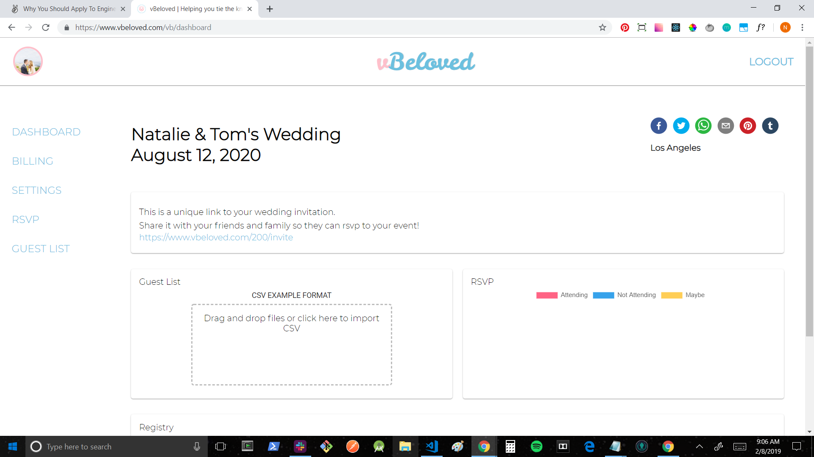
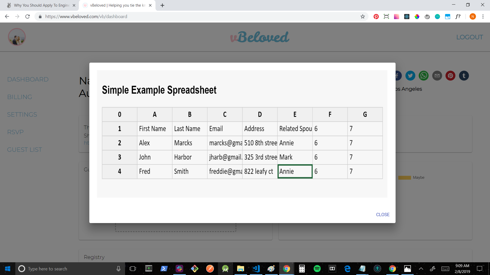
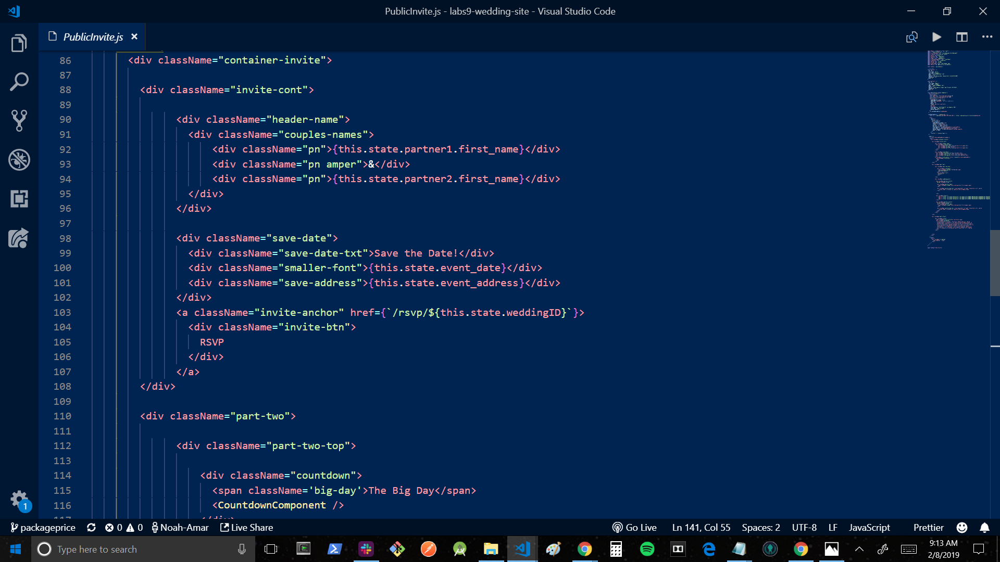

+ Github handle: [Noah-Amar](https://github.com/Noah-Amar)
+ [Github contribution graph](https://github.com/Lambda-School-Labs/labs9-wedding-site/graphs/contributors)

+ front end: https://www.vbeloved.com/
+ back end: https://vbeloved.now.sh/users
+ tech stack: MySQL, Express, React, Node, AWS, Zeit, Netlify
+ app description: Beloved is an application that solves wedding planning by offering personalized invitations and wedding websites, rsvp management, registry management, and more.
+ whiteboarding: https://youtu.be/nAiOIcNFADU

This week I focused on rendering dynamic data to the Public Invitation page, building a CSV Example Modal for the dashboard, redesigning the Home landing page, adding styles across the application, creating share links that dynamically access the guest rsvp page based on weddingID, and working with my team to build a responsive website and deliver a more professional product.

##Front End
+ Ticket 1
    + Trello: Public Invite Data
    + [Github](https://github.com/Lambda-School-Labs/labs9-wedding-site/pull/110)

+ Ticket 2
    + Trello: CSV Example Modal
    + [Github](https://github.com/Lambda-School-Labs/labs9-wedding-site/pull/116)

+ Ticket 3
    + Trello: Front End Styling/Responsive Design
    + [Github](https://github.com/Lambda-School-Labs/labs9-wedding-site/pull/118)

+ Ticket 4
    + Trello: Share Links/Responsive Design
    + [Github](https://github.com/Lambda-School-Labs/labs9-wedding-site/pull/123)

#Detailed Analysis
##Public RSVP
While building the share links for the dashboard, I utilized a library called react-share that allows me to render share buttons with social media apps such as Facebook, Twitter, Tumblr, and Pinterest. It also allows me to utilize other applications such as Whatsapp and email service. By passing props into a stateless component, I was able to call user data and a unique wedding id from a separate component into a url, which allows access to a unique wedding invitation page. By setting the url to a constant, I was then able to call it as a prop inside each share element button. Nested inside each share element button is a corresponding icon element with customizable props rendering the icon to the page, complete with pop-up window share functionality to the correct social media/app. I then styled it to look inline with the desktop and mobile view.

#Forming as a Team
This week our team experienced the true meaning of the 90-90 rule. While working to deliver a final product, we found more than a few bugs with our functionality, UX issues, dealt with tedious responsive design, console errors, and all of the small details that make for a professional application and compound into a lot of time. My personal favorite was finding out how easy it is to build for desktop but how challenging it can be to transform that same design into a mobile view that looks just as good. In the future, I would likely choose to build for mobile first and then expand to desktop rather than the opposite approach we took. In the end, we were able to reach our minimum viable product and some stretch goals as well, and I am proud to have worked together with this team.