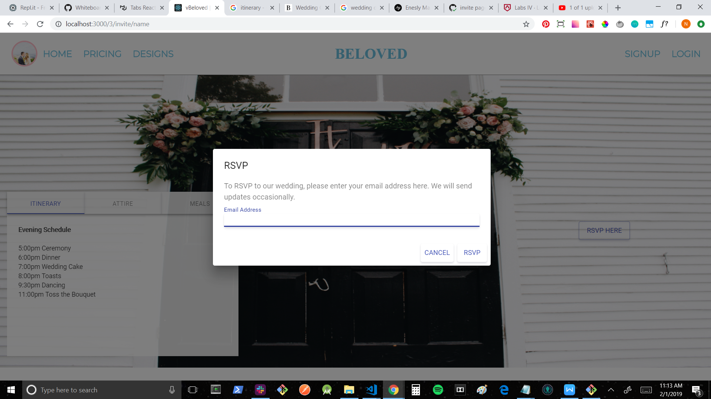
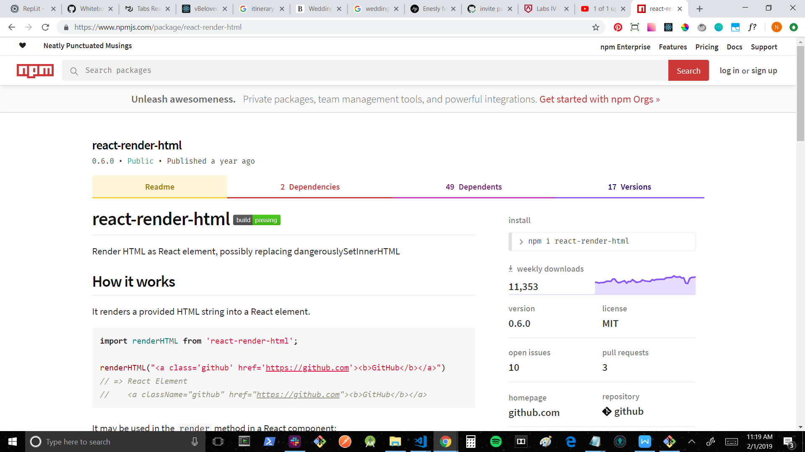
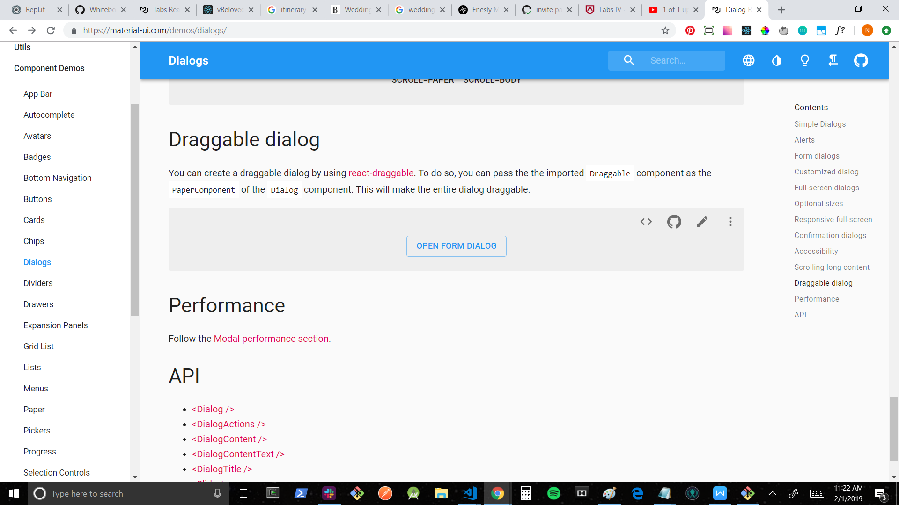

+ Github handle: [Noah-Amar](https://github.com/Noah-Amar)
+ [Github contribution graph](https://github.com/Lambda-School-Labs/labs9-wedding-site/graphs/contributors)

+ front end: https://www.vbeloved.com/
+ back end: https://vbeloved.now.sh/users
+ whiteboarding: https://youtu.be/g08gonu2Xxg

This week I focused on the Public RSVP page, testing different potential templates, and building new components, working with my team to build a responsive website and deliver a more professional product.

#Tasks Pulled
##Front End
+ Ticket 1
    + Trello: Public Invite
    + [Github](https://github.com/Lambda-School-Labs/labs9-wedding-site/pull/93)

+ Ticket 2
    + Trello: Public Invite
    + [Github](https://github.com/Lambda-School-Labs/labs9-wedding-site/pull/99)

+ Ticket 3
    + Trello:
    + 

##Back End

+ Ticket 4
    + Trello: 
    + 

#Detailed Analysis
##Public RSVP
While working on the Public RSVP page, I set out with the intention of finding a themed template compatible with our codebase that I could then edit to match the desired content. I searched on Github, testing various react code, as well as trying to convert html/css/vanillaJS templates to react, but ran into problems with each one. I also attempted importing a library specifically for rendering html as is, inside of a react component, to no avail. In the end, I reverted to working with my teammate on a simpler react component with less complex UI, which we are gradually building upon to suit our needs. I am beginning to add more personalized content, using Material-UI, in which I hope will help create a better user experience, more detailed to our use.

#Forming as a Team
This week was particularly challenging because I spent Tuesday and Wednesday traveling up to Colorado. While I attempted to work during this time, it proved difficult to make solid progress while traveling and intermittently dealing with internet issues. Despite this, my team picked up much of the slack on the front-end and were able to achieve responsiveness for most of the site. While our UI still leaves much to be improved, I feel that I will be able to make up for a lot in this area in the coming week, and am proud of the progress made in responsive design and debugging the back-end. As a team, we created a trello board specifically for this week to intentionally focus on the highest priorities and delegate tasks. I believe this increased our efficiency and ability to shift towards this week's goals.