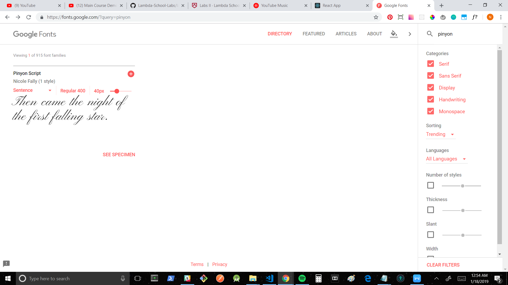
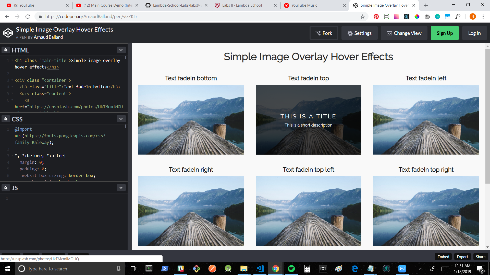
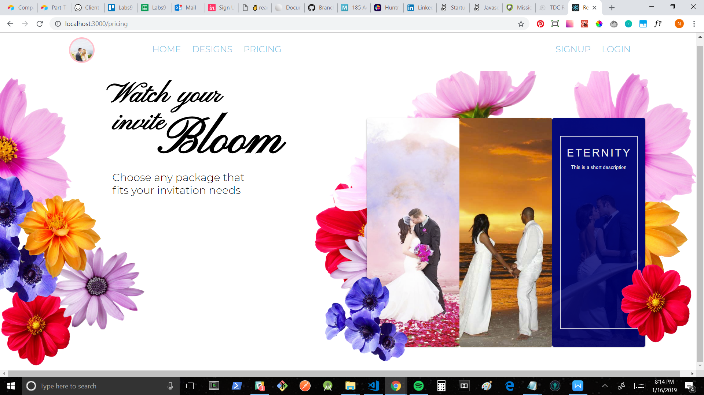

+ Github handle: [Noah-Amar](https://github.com/Noah-Amar)
+ [Github contribution graph](https://github.com/Lambda-School-Labs/labs9-wedding-site/graphs/contributors)

+ front end: https://www.vbeloved.com/
+ back end: https://vbeloved.now.sh/users

This week I added significant UI to the signup page and the login page along with adding an intial new user form, altered the UI of the navigation bar as well as adding it's use to new views, routed the entire application, reorganized the file structure of the application, tackled several git issues with my teammates, added Stripe payment integration to the backend and then connected it to the front end, and likely my biggest contribution being building out the UI for the pricing page. 
#Tasks Pulled
##Front End
+ Ticket 1
    + Trello: SignUp Page
    + [Github](https://github.com/Lambda-School-Labs/labs9-wedding-site/pull/26)

+ Ticket 2
    + Trello: Login Page
    + [Github](https://github.com/Lambda-School-Labs/labs9-wedding-site/pull/26)

+ Ticket 3
    + Trello: Navigation
    + [Github](https://github.com/Lambda-School-Labs/labs9-wedding-site/pull/32)

+ Ticket 4
    + Trello: Routing
    + [Github](https://github.com/Lambda-School-Labs/labs9-wedding-site/pull/24)

+ Ticket 5
    + Trello: Reorganize File Structure
    + [Github](https://github.com/Lambda-School-Labs/labs9-wedding-site/pull/35)

+ Ticket 6
    + Trello: Pricing page
    + [Github](https://github.com/Lambda-School-Labs/labs9-wedding-site/pull/40)

##Back End

+ Ticket 7
    + Trello: Stripe integration
    + [Github](https://github.com/Lambda-School-Labs/labs9-wedding-site/pull/51)

#Detailed Analysis
##Pricing Page
In executing the design for the pricing page, I was determined to make it every pixel as great, if not better, than the mockup page AJ created. I am pretty happy with the way it turned out, albeit I still need to finish responsiveness for smaller screen sizes. To begin, I started getting familiar with the material UI component that my teammate Shannon had kindly began putting together and progressed to figuring out how to add the images in a way that would render to the page (because Material UI is tricky). I then continued to make sure the images were formatting the way they appeared to look in the mockup which took some third-party image re-sizing tools to make the last photo appear as I wanted it to. I then inspected code inside the card component given by Material UI, but I wasn't sure it was all being used and after investigating removed it because it wasn't necessary to what I needed and I would later replace it with my own code. Continuing I knew I had never built anything like the hover animation featured on AJ's mockup, but knew I would find out how and after some google searching I found a codepen with different hover animations that I could begin to learn how to figure out. After a lot of tinkering with the codepen, I came up with a general idea of how it worked and began line by line deleting all the code that I didn't think was relevant to what I wanted to do. Whenever I broke the demo, I pieced it back together and tried again, repeating this process until I got down to just a few lines of code. I then further deconstructed the code, which was pure html and css, and converted it into the jsx and material ui syntax I needed to get it to work with my component. After a lot of detective work and trial and error, I eventually ended up with the finished product almost identical to the mockup on AJ's page. To shorten the rest of the story, I painstakingly spent similar energy styling each individual flower image on the pricing page and finding a similar font to match the fonts AJ requested but would not play well with the other code.

#Forming as a Team
This week we had an interesting time balancing the mvp expectations of getting all of our services integrated while dealing with some pretty heavy git issues. The git issues seriously threw off our workflow which challenged us as a team to get all of our priorities in order and make sure we were working on the most important features. This led to more conversation over efficiency and a complete reorganization of our file structure in efforts to minimize git conflicts and lost time in the future. We held constant communication to get everyone on the same page and tackle other issues that sprung up such as our deployment integration randomly deciding to stop working. We kept continual progress updates and stopped to help each other integrate the expected APIs and services so that we could maintain pace. We also kept a mindful approach of attaining our expected weekly individual contributions while we delegated tasks and considered the perceived weight of different tasks to keep each team member feeling as though they're making valuable additions to our codebase. Moving into more detail of how my own work interacts with the services we included, I created the UI and front end functionality that interacts with our Facebook and Google OAuthentication as well as the backend code that interacts with our billing page processing payment with Stripe. All in all despite the week's difficulties, our team made a lot of progress that I am happy with and expect to build upon in the coming week.