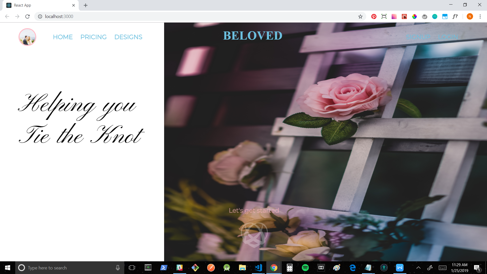
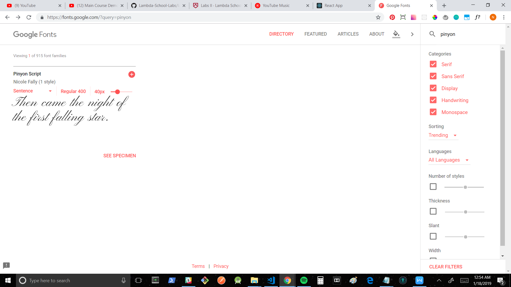
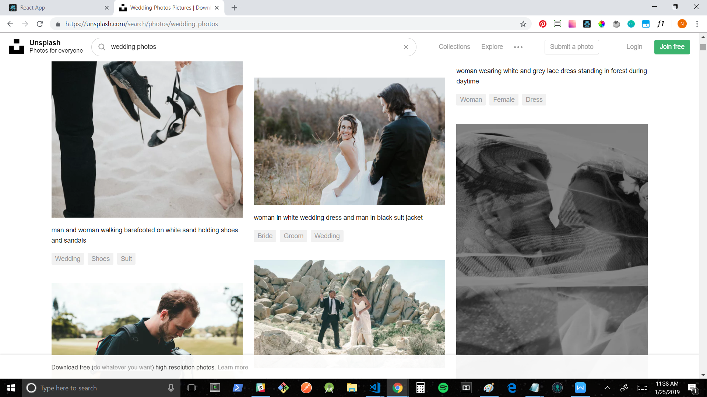

+ Github handle: [Noah-Amar](https://github.com/Noah-Amar)
+ [Github contribution graph](https://github.com/Lambda-School-Labs/labs9-wedding-site/graphs/contributors)

+ front end: https://www.vbeloved.com/
+ back end: https://vbeloved.now.sh/users
+ whiteboarding: https://youtu.be/M3SkyqA4OaE

This week I added significant UI to the landing page, involving creating the landing page, re-structuring the layout of the pricing and designs pages to fit within the confines of the landing page, adding an automatic scrolldown feature that features each page individually, and altering the look of the navigation bar to better flow with the new design. I also pair-programmed with my new teammate Hargobind to build out functionality for a new public-facing RSVP page with which guests of the wedding party can interact with.

#Tasks Pulled
##Front End
+ Ticket 1
    + Trello: Landing Page
    + [Github](https://github.com/Lambda-School-Labs/labs9-wedding-site/pull/59)

+ Ticket 2
    + Trello: Automatic Scrolldown
    + [Github](https://github.com/Lambda-School-Labs/labs9-wedding-site/pull/67)

+ Ticket 3
    + Trello: Separate Landing Page Views
    + [Github](https://github.com/Lambda-School-Labs/labs9-wedding-site/pull/75)

##Back End

+ Ticket 4
    + Trello: Public RSVP
    + [Github](https://github.com/Lambda-School-Labs/labs9-wedding-site/tree/public-rsvp)

#Detailed Analysis
##Landing Page
In creating the design for the landing page, I wanted to keep the overall 40/60 split content layout that AJ created while choosing a different image that better aligned with the color scheme and theme of the site. I searched for a photo that matched the soft blue or pink that we were using in some way, and preferably would appeal to as broad of an audience as possible without excluding any demographic. I rested upon a photo of some pink and yellow roses growing around a white wooden frame, with blue and pink light glowing behind the upper corners, and a soft blurring of the image around the edges. I asked AJ for a more transparent version of the logo he created in the mockup and (after adding a little more opacity) placed it at the bottom center of the page, aiming for a subtle look that didn't distract from the rest of the page, but would act as an anchor for the "Lets get started" call-to-action text that when hovered over, lights up a soft pink and sends you to the next page when clicked (both the text and logo being clickable to achieve the same action). I used the same black cursive Pinyon Script font from the pricing page for the message on the left hand side of the landing page for consistency and a cleaner look than a colored font. I also adjusted the previously white navigation bar to have no background to better blend and not cover up any content.

#Forming as a Team
This week my team faced the challenge of working to become feature complete during a shortened week. Luckily, we were joined by our new teammate Hargobind, bringing our numbers from 4 to 5. This helped immensely, allowing us to all work on seperate features necessary to finish to reach feature completeness, and provided another set of eyes to help troubleshoot problems when any of us ran into trouble. Arthur was able to continue working on fully finishing the billings page, Shannon and Brian were able to work on fully finishing the guestlist and rsvp features, Hargobind was able to work on creating a new public rsvp page, and I was able to work on creating the landing page and later pair-program on the public rsvp page with Hargobind. Each feature required a lot of work and often more time than we anticipated, which is one of the recurring hurdles that we ran into, but through our persistence we were able to crank out results. This week, I've felt us grow stronger together as a team and I'm very happy for our new addition Hargobind.